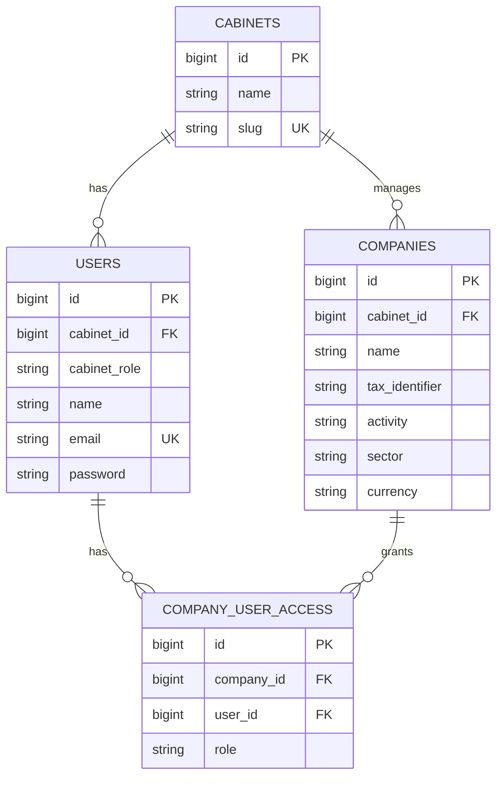
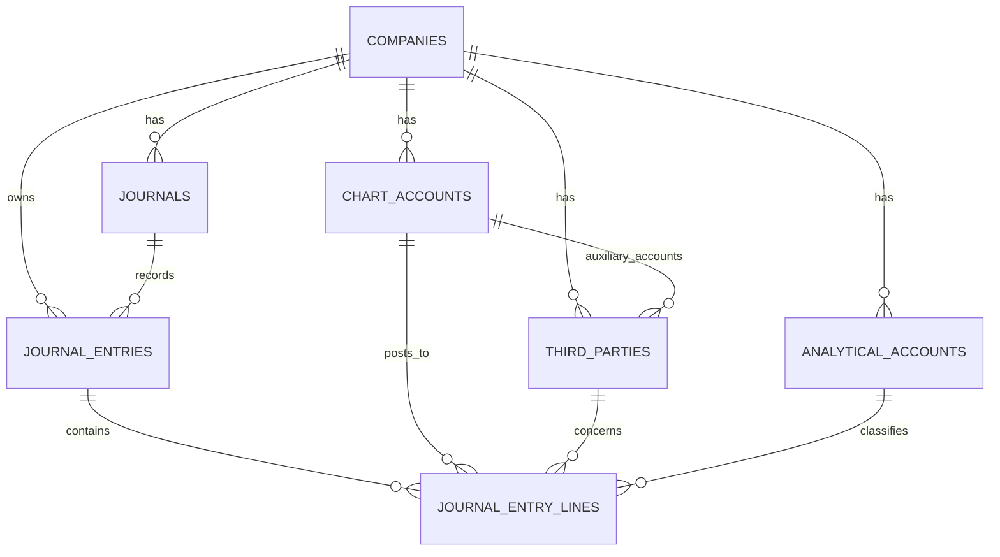

# Architecture & décisions

## Source de vérité et livraison incrémentale

Le cahier des charges client est documenté dans [`requirements.md`](requirements.md). Le projet est livré dans l’ordre de ses cinq phases. Les Phases 1 (fondation multi-cabinet), 2 (référentiels comptables avec données d’exemple) et l’intake de la Phase 3 (factures/lignes, upload privé, doublons et consultation scoppée) sont implémentées. Aucun OCR, import `.mae` ou transfert Sage réel n’est actuellement exécuté.

## Stack

- Laravel 13 et PHP 8.3+ pour l’application monolithique, les sessions, l’autorisation, les règles métier, le stockage et les jobs.
- Inertia.js, React 19 et TypeScript pour les pages et composants d’interface ; Tailwind CSS pour les utilitaires de présentation.
- MySQL comme base d’exécution principale. SQLite en mémoire reste réservé aux tests automatisés.
- Les mutations des Phases 1 et 2 sont synchrones. La Phase 3 stocke les fichiers mais ne planifie aucun job ; la Phase 4 introduira une queue persistante et un worker pour le traitement OCR.
- Mistral OCR et Mistral Small sont les fournisseurs demandés pour les phases IA ; ils seront isolés des contrôleurs derrière des contrats de service. Aucune clé ni réponse IA n’est requise pour les Phases 1 à 3.
- Les sources facture de la Phase 3 utilisent le disque Laravel `local` (`storage/app/private` par défaut) et ne sont accessibles qu’au travers d’une route de téléchargement authentifiée et autorisée.

Le serveur Vite `preview:ui` est un aperçu autonome non persistant pour examiner le tableau de bord et les données comptables fictives. L’application Laravel utilise `resources/views/app.blade.php` et `resources/js/app.tsx`; `ToastHost` et `RequestToastEvents` sont montés dans l’entrée Inertia.

## Modèle de données de la Phase 1

`cabinet_id` est obligatoire pour les utilisateurs. `cabinet_role` distingue les administrateurs du cabinet des membres ; `company_user_access.role` porte les rôles société (`invoice_manager`, `company_user`). L’administrateur de cabinet peut accéder à toutes les sociétés de son cabinet. Pour les autres utilisateurs, seule une ligne pivot accorde l’accès. Les policies et les validations contrôlent également que l’utilisateur et la société relèvent du même cabinet.

## Modèle de données de la Phase 2

Les comptes généraux/analytique, tiers et journaux ont un code texte unique par société. `journal_entries` porte la société et le journal ; chaque ligne conserve son compte général et peut référencer un tiers et un axe analytique. Débit/crédit sont `DECIMAL(18,3)` pour ne pas perdre les millimes TND. Les actions de consultation sont scoppées par la relation de la société autorisée. Le petit jeu `SeedDemoAccountingData` est transactionnel et idempotent ; le seeder et la route de démonstration ne sont actifs qu’en `local`/`testing`.

### Intake des factures — Phase 3

Les migrations `000015`–`000016` créent `invoices` et `invoice_lines`. Une facture est rattachée à une société ; son tiers, son importateur et les valeurs OCR/montants sont nullable selon disponibilité. L’état initial est `uploaded`. Les lignes sont préparées par le schéma mais aucune ligne n’est générée avant OCR.

`InvoiceController` reçoit un fichier par requête et s’appuie sur `UploadInvoiceFileRequest`, `CompanyPolicy::manageInvoices` et `StoreInvoiceUpload`. Le client traite un lot séquentiellement (limite d’interface 300 fichiers, limite serveur 20 Mo par fichier). Le service stocke le document sur le disque `local`, sous un chemin société, puis enregistre MIME, taille, nom d’origine et empreinte SHA-256. Les erreurs de persistance tentent de supprimer le fichier déjà écrit.

La détection SHA-256 s’effectue au niveau de la société, sous verrou de la ligne société afin de sérialiser les uploads concurrents. Si le contenu existe déjà, le serveur répond `409` sans nouvelle persistance, sauf confirmation explicite. La liste est paginée et n’expose jamais `file_path`. Le téléchargement vérifie le droit `view` de la société et l’égalité `invoice.company_id === company.id` avant de transmettre le document depuis le disque privé.

L’import ne démarre pas encore de Job et n’appelle pas Mistral. Le schéma cible complet (dont les propositions) et le flux OCR sont détaillés dans le cahier des charges.

## Responsabilités actuelles

- `AuthenticatedSessionController` / `LoginRequest` : connexion par session, normalisation d’e-mail, limitation des tentatives, déconnexion sécurisée.
- `Cabinet` / `Company` / `User` : relations entre cabinet, sociétés et accès.
- `CompanyPolicy` : contrôle d’accès cabinet/société, gestion des données comptables et gestion/import des factures.
- `StoreCompanyRequest` / `StoreCabinetUserRequest` / `UploadInvoiceFileRequest` : validation serveur, dont l’interdiction d’affecter une société d’un autre cabinet et les formats/tailles d’upload autorisés.
- `CompanyController` / `CabinetUserController` : liste de sociétés accessibles, création réservée à l’admin, création d’utilisateur et affectation de rôles.
- `AccountingDataController` : consulte les référentiels/historiques d’une société autorisée et expose le chargement démo uniquement en local/test ; `SeedDemoAccountingData` prépare le dataset sans lire Sage.
- `InvoiceController` : liste les factures d’une société, enregistre un fichier soumis au contrôle de doublons et transmet les téléchargements privés. `StoreInvoiceUpload` gère stockage et métadonnées ; il ne lance pas d’OCR.
- `DashboardController` : sociétés visibles limitées au cabinet et aux rôles de l’utilisateur.
- `HandleInertiaRequests` : données authentifiées et cabinet partagé avec les pages Inertia.
- `resources/js/Pages` : adaptateurs/pages, dont `AccountingData/Show` et `Invoices/Index` ; `resources/js/Components/AppShell.tsx` : navigation globale et liens contextuels par société ; `ToastHost` / `RequestToastEvents` : retours de succès/erreur.
- Les formulaires d’action déclenchent un toast dans leurs callbacks `onSuccess`/`onError`, afin de produire un retour à chaque requête même si deux succès consécutifs ont le même libellé.

## Isolation multi-tenant

Chaque société appartient à un cabinet. Les listes admin partent de `cabinet_id`; les listes de membres partent de la relation many-to-many. Les affectations d’utilisateurs sont validées contre le cabinet de l’administrateur. Les lectures comptables et factures de la Phase 2/3 utilisent les relations du `Company` autorisé ; le téléchargement vérifie en plus que la facture appartient à la société de la route. Aucun `company_id` fourni par le client n’est utilisé pour choisir le tenant. Les futurs jobs OCR devront conserver la même portée.

## Décisions et compatibilité

1. **Rôles séparés par portée.** `cabinet_role` porte l’administration du cabinet ; le pivot `company_user_access` porte les droits société. Cela permet à un membre d’avoir des accès différents d’une société à l’autre.
2. **Données de société configurables.** Activité, secteur, matricule fiscal, code pays/devise et identifiant Sage externe sont séparés. Le jeu Phase 2 est explicitement fictif et n’est pas présenté comme un import Sage réel.
3. **Codes en chaînes et précision TND.** Les identifiants des comptes/axes/tiers/journaux conservent zéros initiaux et codes non numériques ; les montants utilisent trois décimales pour les millimes tunisiens.
4. **Migration depuis le premier MVP.** Les tables historiques `documents`/`accounting_entries` ont été créées dans le premier push et restent intactes. Les tables `invoices`/`invoice_lines` de la Phase 3 coexistent avec elles ; aucune donnée n’est copiée, réinterprétée ou supprimée silencieusement. Une migration de compatibilité rattache chaque ancien compte propriétaire à son propre cabinet afin de ne pas fusionner les espaces ; toute migration/suppression des anciennes tables exige une décision, une sauvegarde et un traitement explicites.
5. **Contexte fiscal.** Les données de démonstration reflètent un contexte tunisien et une devise TND, mais ne codent pas de règles fiscales ni de calculs de TVA non spécifiés.
6. **Aperçu Vite.** Il utilise des données fictives locales et n’est pas une API, une persistance de test, ni un traitement OCR.
7. **Nom d’interface.** « ComptaFlow » est le nom de travail du prototype ; le cahier des charges ne fournit pas de nom de marque officiel.

## Sécurité et exploitation

- Routes métier protégées par `auth`; policies et requêtes restent tenant-scoped.
- Les sources facture sont privées et téléchargées uniquement via une route authentifiée et limitée à une société autorisée ; les chemins n’apparaissent pas dans le navigateur. Les futures réponses externes devront suivre le même contrôle d’accès.
- Les jobs d’IA devront être idempotents, journaliser l’état/durée/modèle utile, gérer timeout/erreurs et ne jamais finaliser une écriture sans validation humaine.
- Ne jamais inclure de clé Mistral ou identifiants réels dans Git ; utiliser les variables d’environnement et garder les logs minimaux.
- Les tests DB utilisent SQLite en mémoire ; pour le lancement applicatif, configurer MySQL comme décrit dans le README.
- Le chargement du jeu Sage-like est bloqué hors des environnements `local` et `testing`; il ne doit jamais remplacer un import ou une restauration de données réelles.
