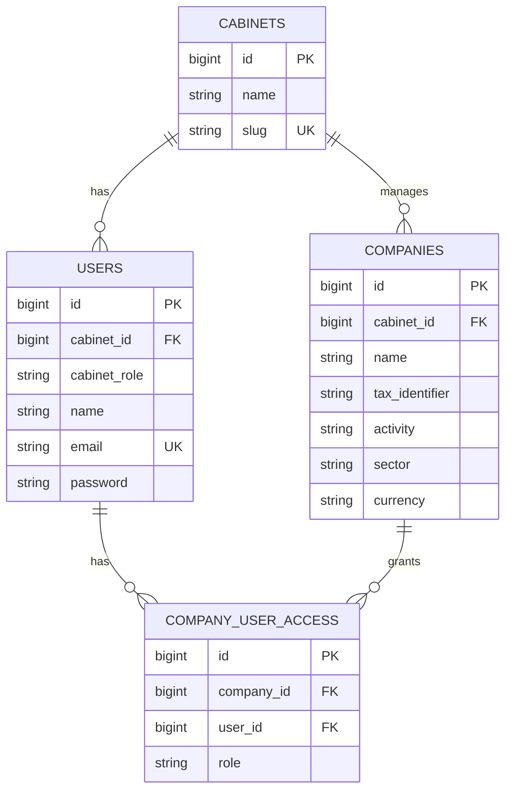

# Architecture & décisions

## Source de vérité et livraison incrémentale

Le cahier des charges client est documenté dans [`requirements.md`](requirements.md). Le projet est livré dans l’ordre de ses cinq phases. Le premier lot est la fondation multi-cabinet et multi-société ; aucune route actuelle ne prétend effectuer une reconnaissance OCR ou une intégration Sage.

## Stack

- Laravel 13 et PHP 8.3+ pour l’application monolithique, les sessions, l’autorisation, les règles métier, le stockage et les jobs.
- Inertia.js, React 19 et TypeScript pour les pages et composants d’interface ; Tailwind CSS pour les utilitaires de présentation.
- MySQL comme base d’exécution principale. SQLite en mémoire reste réservé aux tests automatisés.
- Queue Laravel `sync` pendant la Phase 1, sans traitement en arrière-plan ; les phases OCR introduiront une queue persistante et un worker configuré.
- Mistral OCR et Mistral Small sont les fournisseurs demandés pour les phases IA ; ils seront isolés des contrôleurs derrière des contrats de service. Aucune clé ni réponse IA n’est requise pour la Phase 1.
- Stockage privé Laravel pour les pièces de facture (Phase 3).

Le serveur Vite `preview:ui` est un aperçu autonome non persistant pour examiner l’interface de la Phase 1. L’application Laravel utilise `resources/views/app.blade.php` et `resources/js/app.tsx`.

## Modèle de données de la Phase 1

`cabinet_id` est obligatoire pour les utilisateurs. `cabinet_role` distingue les administrateurs du cabinet des membres ; `company_user_access.role` porte les rôles société (`invoice_manager`, `company_user`). L’administrateur de cabinet peut accéder à toutes les sociétés de son cabinet. Pour les autres utilisateurs, seule une ligne pivot accorde l’accès. Les policies et les validations contrôlent également que l’utilisateur et la société relèvent du même cabinet.

La Phase 2 ajoutera les référentiels de compte, tiers, journaux, sections analytiques et écritures. La Phase 3 ajoutera `invoices`, `invoice_lines` et les propositions. Le schéma cible complet est dans le cahier des charges.

## Responsabilités actuelles

- `AuthenticatedSessionController` / `LoginRequest` : connexion par session, normalisation d’e-mail, limitation des tentatives, déconnexion sécurisée.
- `Cabinet` / `Company` / `User` : relations entre cabinet, sociétés et accès.
- `CompanyPolicy` : contrôle d’accès cabinet/société et capacité d’administration.
- `StoreCompanyRequest` / `StoreCabinetUserRequest` : validation serveur, dont l’interdiction d’affecter une société d’un autre cabinet.
- `CompanyController` / `CabinetUserController` : liste de sociétés accessibles, création réservée à l’admin, création d’utilisateur et affectation de rôles.
- `DashboardController` : sociétés visibles limitées au cabinet et aux rôles de l’utilisateur.
- `HandleInertiaRequests` : données authentifiées et cabinet partagé avec les pages Inertia.
- `resources/js/Pages` : adaptateurs/pages ; `resources/js/Components/AppShell.tsx` : navigation de l’espace.

## Isolation multi-tenant

Chaque société appartient à un cabinet. Les listes admin partent de `cabinet_id`; les listes de membres partent de la relation many-to-many. Les affectations d’utilisateurs sont validées contre le cabinet de l’administrateur. Une future requête facture, job ou donnée comptable doit dériver son périmètre de société depuis le modèle autorisé et ne jamais faire confiance à un `company_id` arbitraire fourni par le client.

## Décisions et compatibilité

1. **Rôles séparés par portée.** `cabinet_role` porte l’administration du cabinet ; le pivot `company_user_access` porte les droits société. Cela permet à un membre d’avoir des accès différents d’une société à l’autre.
2. **Données de société configurables.** Activité, secteur, matricule fiscal, code pays/devise et identifiant Sage externe sont séparés. Aucun plan comptable ni format Sage n’est inventé avant la Phase 2 et l’inspection du `.mae`.
3. **Comptes en chaînes.** Les identifiants des comptes Sage conservent zéros initiaux et codes non numériques.
4. **Migration depuis le premier MVP.** Les tables historiques `documents`/`accounting_entries` ont été créées dans le premier push. Les nouvelles routes Phase 1 ne les utilisent plus. Une migration de compatibilité rattache chaque ancien compte propriétaire à son propre cabinet afin de ne pas fusionner les espaces ; les tables anciennes ne doivent pas être présentées comme le futur schéma facture. Leur suppression éventuelle sera explicite après sauvegarde et migration de données.
5. **Contexte fiscal.** Les exemples fournis (DT, FODEC, matricule fiscal) orientent les données de démonstration vers la Tunisie, mais les codes pays/devises restent configurables et aucune règle fiscale n’est codée sans spécification.
6. **Aperçu Vite.** Il utilise des données fictives locales et n’est pas une API, une persistance de test, ni un traitement OCR.
7. **Nom d’interface.** « ComptaFlow » est le nom de travail du prototype ; le cahier des charges ne fournit pas de nom de marque officiel.

## Sécurité et exploitation

- Routes métier protégées par `auth`; policies et requêtes restent tenant-scoped.
- Les fichiers et réponses externes seront privés et limités au rôle/société concerné.
- Les jobs d’IA devront être idempotents, journaliser l’état/durée/modèle utile, gérer timeout/erreurs et ne jamais finaliser une écriture sans validation humaine.
- Ne jamais inclure de clé Mistral ou identifiants réels dans Git ; utiliser les variables d’environnement et garder les logs minimaux.
- Les tests DB utilisent SQLite en mémoire ; pour le lancement applicatif, configurer MySQL comme décrit dans le README.
