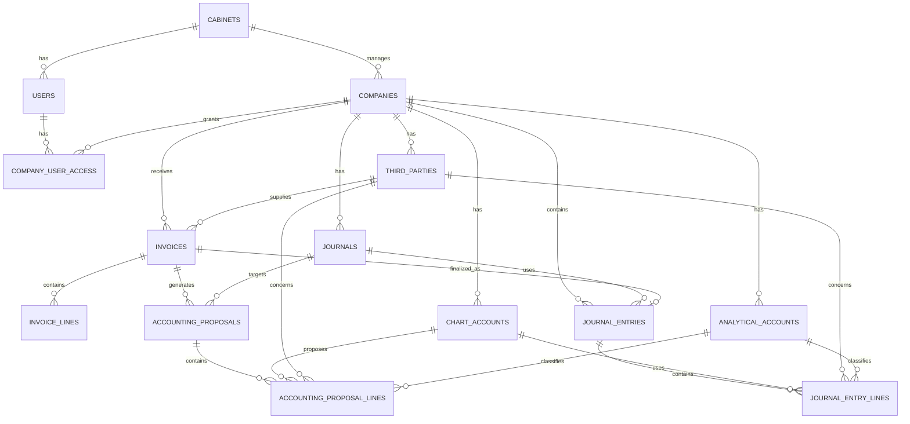

# Cahier des charges — Plateforme AI de saisie comptable automatisée

Ce document retranscrit les exigences métier et techniques communiquées par le client. Il constitue la source de vérité produit ; les PRD des modules doivent rester cohérents avec lui.

## 1. Vision et résultat attendu

La plateforme assiste les cabinets d’expertise comptable et les services comptables d’entreprises dans le traitement de factures fournisseurs. Elle doit analyser une facture au-delà de l’OCR, tenir compte du profil comptable de l’entreprise et de ses données Sage, puis présenter une proposition d’écriture que l’utilisateur révise et valide avant toute finalisation ou intégration dans Sage.

**Flux cible :**

```text
Import → OCR structuré → facture persistée → analyse comptable contextualisée
       → proposition contrôlée → revue humaine → écriture validée → transfert Sage
```

L’IA ne doit ni exécuter de SQL ni modifier directement les écritures comptables définitives.

## 2. Cabinets, sociétés et rôles

Un cabinet gère plusieurs sociétés et plusieurs utilisateurs. Un utilisateur peut accéder à plusieurs sociétés de son cabinet : aucun `company_id` unique ne doit être porté par `users`. L’accès à une société et son rôle sont portés par `company_user_access`.

- `cabinet_admin` : gère son cabinet, ses sociétés et ses utilisateurs.
- `invoice_manager` : traite et gère les factures des sociétés auxquelles il a accès.
- `company_user` : consulte ou révise les sociétés qui lui sont attribuées.

Toutes les requêtes métier doivent être isolées par cabinet et par société, puis autorisées par policy et contrôle d’accès.

## 3. Import et reconnaissance des factures

L’utilisateur peut déposer plusieurs factures à la fois : PDF, JPG/JPEG, PNG, scans et factures électroniques. Le traitement en masse doit tolérer plusieurs centaines de documents. Chaque fichier est traité indépendamment et dispose de son propre état de progression ; un échec ne bloque pas les autres fichiers.

Le traitement démarre automatiquement après l’import et utilise des Laravel Jobs/Queues :

1. persister le fichier dans un stockage privé et planifier le traitement OCR ;
2. utiliser OCR.space Free Engine 3 par défaut pour transcrire le texte ; conserver Mistral comme fournisseur sélectionnable, qui retourne déjà une annotation structurée ;
3. pour le texte OCR.space, appeler OpenRouter avec un modèle gratuit d’extraction sans raisonnement (Qwen3.8 27B par défaut) et un schéma JSON strict conforme au contrat facture ; demander uniquement le JSON, sans explication ni calcul ; conserver la réponse OCR brute, la transcription et la réponse d’extraction OpenRouter séparément ;
4. valider la structure, persister les données utilisables et bloquer l’analyse tant que les champs requis manquent ; permettre à un gestionnaire autorisé de corriger ces champs ;
5. dès que les données sont complètes, lancer automatiquement un second appel OpenRouter pour l’analyse comptable contextualisée, persister la proposition et signaler les étapes, erreurs et résultats dans l’interface.

Le chemin Mistral structuré évite un appel supplémentaire de structuration, mais l’analyse comptable utilise OpenRouter. Les réponses brutes et les données structurées restent distinctes pour audit.

Données à extraire lorsqu’elles sont disponibles : fournisseur, matricule fiscal, client/société, numéro et dates de facture/échéance, devise, HT, montants et taux de TVA, FODEC, timbre fiscal, retenue à la source, TTC, lignes de facture, nature/description, conditions de paiement, références et informations bancaires pertinentes. Vérifier la cohérence des montants, notamment :

```text
HT + TVA + autres taxes + timbre − retenues = total à payer
```

La règle exacte doit tenir compte de la représentation des retenues et taxes dans le document ; une incohérence doit être explicitement signalée, pas corrigée silencieusement.

## 4. Analyse comptable par IA

Après l’OCR, le contexte retenu doit être limité à la société concernée : activité, secteur, paramètres comptables/fiscaux, comptes, auxiliaires, journaux, sections analytiques, historique, règles configurées et correspondances fournisseur/type de facture vers comptes.

OpenRouter `openrouter/free` reçoit les données structurées de la facture et ce contexte pour produire une proposition comprenant journal, tiers fournisseur existant si appariement certain, comptes existants, lignes débit/crédit, ventilation analytique, libellés et explication. Les codes permis sont limités aux références actives de la société et encodés en énumérations du schéma de sortie. Le modèle réellement renvoyé (routeur gratuit dynamique), l’usage et la réponse sont conservés pour audit. Les factures multi-natures peuvent produire plusieurs lignes.

Les comptes ne sont jamais inventés par le modèle : chaque compte proposé doit appartenir au plan comptable importé pour la société. Le contexte d’une entreprise ne doit jamais être utilisé pour une autre entreprise.

## 5. Proposition, validation et apprentissage

La sortie du modèle est validée contre un schéma JSON strict puis contrôlée par des règles déterministes avant d’être stockée dans `accounting_proposals` et `accounting_proposal_lines`. La revue humaine permet de corriger les données facture et la proposition, puis de l’accepter ou la rejeter. Seule une action explicite de validation crée une écriture liée à la facture ; aucune écriture n’est créée pendant l’extraction ou l’analyse.

Contrôles déterministes prévus :

- total débit = total crédit ;
- cohérence des totaux et de la TVA ;
- existence et appartenance à la société des comptes, journaux, tiers et sections ;
- complétude et cohérence des dates, devise et numéro de facture ;
- détection de doublons selon fournisseur, numéro, date, montant, matricule fiscal et empreinte numérique du fichier ;
- champs facture obligatoires (fournisseur, numéro, date, devise, total, description/ligne) : leur absence bloque l’appel comptable jusqu’à correction ;
- références OpenRouter, journaux, tiers et axes revalidées à l’approbation côté société, et aucune création en cas de déséquilibre ou de total incompatible.

Les corrections validées peuvent alimenter une mémoire comptable par société (par exemple fournisseur → type → compte), configurable et contrôlée par l’utilisateur. Elles ne changent jamais automatiquement une écriture déjà validée.

## 6. Données comptables Sage

Au départ, les données pertinentes sont importées ou mockées dans la base applicative : plan comptable, sections analytiques, tiers, journaux, historique des écritures et paramètres utiles. Le connecteur doit rester extensible pour synchroniser Sage ultérieurement.

La version/base Sage et le fichier `.mae` ne sont pas fournis à ce stade. Le schéma d’import final doit donc rester différé jusqu’à inspection de ces sources. Aucun transfert réel ne doit être présenté comme disponible avant validation de la version Sage et de son interface d’intégration.

## 7. Interface et tableau de bord

La boîte de dialogue présente le texte OCR brut, les champs structurés, les avertissements et la proposition. L’utilisateur autorisé peut corriger les champs facture, modifier les lignes de proposition, consulter confiance/contrôles, rejeter ou valider. Aucune écriture n’est créée avant validation humaine explicite.

Le tableau de bord cible : factures importées, analysées, validées, en attente et à corriger ; taux de reconnaissance et de validation automatique ; erreurs ; temps économisé ; écritures générées.

## 8. Modèle de données de référence



Important constraints: `invoices.third_party_id` is nullable until supplier matching; account codes are strings to preserve leading zeros and non-numeric codes; company membership is many-to-many through `company_user_access`.

## 9. Architecture and stack demandés

- Application monolithique **Laravel 13**, PHP 8.3+, **MySQL**.
- **React 19**, Inertia.js, TypeScript and **Tailwind CSS** in the same Laravel application.
- Laravel handles routes, session authentication, authorization, tenant isolation, persistence, uploads, queues, validation and business logic.
- Laravel Queues handle invoice work independently; Redis is optional only when useful for queue/cache.
- OCR.space Free Engine 3 par défaut (texte OCR) ou Mistral OCR sélectionnable (annotation structurée) ; Qwen3.8 27B gratuit via OpenRouter pour structurer le texte selon le schéma JSON strict (raisonnement désactivé, 2 500 tokens de sortie par défaut, configurable de 2 000 à 3 000), et OpenRouter `openrouter/free` pour les propositions comptables.
- Controllers, Services, Models, DTOs, Form Requests, Jobs, Policies and React pages/components have distinct responsibilities.
- External AI providers are isolated behind replaceable service contracts. API calls do not live in controllers. Errors, timeouts and invalid responses are handled explicitly.
- Use pagination, scoped queries, eager loading, selected columns, indexes and useful cache only where appropriate. Avoid unnecessary packages and abstractions.

## 10. Incremental delivery phases

1. **Foundation:** Laravel, auth, cabinets, users, companies, company roles/access and policies.
2. **Accounting data:** accounts, analytical accounts, third parties, journals, entries/lines, mock Sage data.
3. **Invoices:** multi-file upload, private storage, invoice/invoice-line schema, states and validation.
4. **OCR and extraction:** OCR.space Engine 3 default, Mistral alternative, OpenRouter strict-JSON structuring, audit and traceable failures.
5. **AI accounting:** OpenRouter free router, company-scoped context, proposal schema, deterministic controls, human review/reject/approval.

Each phase must remain functional and testable before the next is started. Sage synchronization/export stays deferred until its concrete interface is known.
